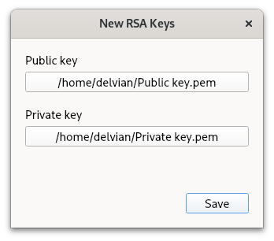
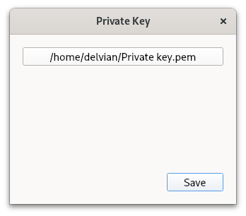
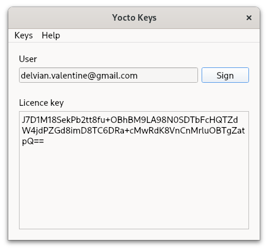

# Yocto Keys

Make licence keys using RSA signature verification

## Installation

```bash
pip install keys-yocto
```

## Usage

You'll be prompted to make new RSA keys the first time you run the app.  If you need to make new keys later, you can do it in the Keys menu.



The app will remember where you saved the last private key that you made.  If you need to use a different key than the last one that you made or if you moved it, you can change the location of the key in the Keys menu.



Fill in the user's details and click Sign.  Then copy the licence key and send it to the user.



### How to verify licence keys in your app

```python
from keys import key

if key.valid(user, licence_key, pub_key):
	# licence_key is valid
else:
	# licence_key is invalid
```

## Support

Email delvian.valentine@gmail.com for help.

## Contributing

Pull requests are welcome.  For major changes, please open an issue first to discuss what you'd like to change.

## Acknowledgements

*   [Qt for Python](https://wiki.qt.io/Qt_for_Python) to make the GUI.
*   [Python-RSA](https://stuvel.eu/software/rsa/) to make and verify the keys.
*   [PyInstaller](https://pyinstaller.org/en/stable/) to package the app.
*   This app is inspired by [this article](https://build-system.fman.io/generating-license-keys).

## Licence

Copyright © 2023  [Delvian Valentine](mailto:delvian.valentine@gmail.com)

_This program comes with ABSOLUTELY NO WARRANTY.  
This is free software, and you are welcome to redistribute it under certain conditions.  
See the [GNU General Public License](https://www.gnu.org/licenses/) for details._  
